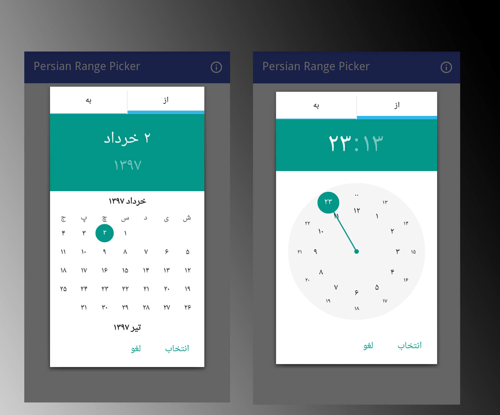

# PersianDateRangePicker
[](https://jitpack.io/#bkhezry/PersianDateRangePicker)

Select range of dates and times in the Persian Calender

**Project Setup and Dependencies**
- JDK 8
- Android SDK Build tools 27.0.3
- Supports API Level +17
- AppCompat & Design libraries 27.1.1

## A quick overview
- compatible with **API Level +17**
- **RTL** support
- **Custom Font** support

# Preview
## Demo
You can download the latest demo APK from here: https://github.com/bkhezry/PersianDateRangePicker/blob/master/assets/PersianDateRangePicker.apk

## Screenshots



# Setup
## 1. Provide the gradle dependency
Add it in your root build.gradle at the end of repositories:
```gradle
allprojects {
	repositories {
		...
		maven { url "https://jitpack.io" }
	}
}
```
Add the dependency:
```gradle
dependencies {
	implementation 'com.github.bkhezry:PersianDateRangePicker:1.2.2'
}
```
Using the  Pickers
--------------------------------

1. Implement an `PersianDatePickerDialog.OnDateSetListener` or `PersianTimePickerDialog.OnTimeSetListener`
2. Create a `PersianDatePickerDialog` using the supplied factory

### Implement an `OnDateSetListener`
In order to receive the date  set in the picker, you will need to implement the `OnDateSetListener` interfaces. Typically this will be the `Activity` or `Fragment` that creates the Pickers.

or
### Implement an `OnTimeSetListener`
In order to receive the time set in the picker, you will need to implement the `OnTimeSetListener` interfaces. Typically this will be the `Activity` or `Fragment` that creates the Pickers.

```java

//new onDateSet
@Override
public void onDateSet(DatePickerDialog view, int year, int monthOfYear, int dayOfMonth,int yearEnd, int monthOfYearEnd, int dayOfMonthEnd) {
String monthString = String.valueOf(monthOfYear + 1);
    if (monthOfYear < 9) {
      monthString = "0" + monthString;
    }
    String dayString = String.valueOf(dayOfMonth);
    if (dayOfMonth < 10) {
      dayString = "0" + dayString;
    }
    String monthStringEnd = String.valueOf(monthOfYearEnd + 1);
    if (monthOfYearEnd < 9) {
      monthStringEnd = "0" + monthStringEnd;
    }
    String dayStringEnd = String.valueOf(dayOfMonthEnd);
    if (dayOfMonthEnd < 10) {
      dayStringEnd = "0" + dayStringEnd;
    }
    fromDate.setText(String.format("%s/%s/%s", LanguageUtils.getPersianNumbers(String.valueOf(year)), LanguageUtils.getPersianNumbers(monthString), LanguageUtils.getPersianNumbers(dayString)));
    toDate.setText(String.format("%s/%s/%s", LanguageUtils.getPersianNumbers(String.valueOf(yearEnd)), LanguageUtils.getPersianNumbers(monthStringEnd), LanguageUtils.getPersianNumbers(dayStringEnd)));
}

@Override
public void onTimeSet(PersianRadialPickerLayout view, int year, int monthOfYear, int dayOfMonth,int yearEnd, int monthOfYearEnd, int dayOfMonthEnd) {
      String hourString = String.valueOf(hourOfDay);
    if (hourOfDay < 10) {
      hourString = "0" + hourString;
    }
    String minuteString = String.valueOf(minute);
    if (minute < 10) {
      minuteString = "0" + minuteString;
    }
    String hourStringEnd = String.valueOf(hourOfDayEnd);
    if (hourOfDayEnd < 10) {
      hourStringEnd = "0" + hourStringEnd;
    }
    String minuteStringEnd = String.valueOf(minuteEnd);
    if (minuteEnd < 10) {
      minuteStringEnd = "0" + minuteStringEnd;
    }
    fromTime.setText(String.format("%s:%s", LanguageUtils.getPersianNumbers(hourString), LanguageUtils.getPersianNumbers(minuteString)));
    toTime.setText(String.format("%s:%s", LanguageUtils.getPersianNumbers(hourStringEnd), LanguageUtils.getPersianNumbers(minuteStringEnd)));

}
```

### Create a PersianDatePickerDialog` using the supplied factory
You will need to create a new instance of `PersianDatePickerDialog` using the static `newInstance()` method, supplying proper default values and a callback. Once the dialogs are configured, you can call `show()`.
```java
  PersianDate now = new PersianDate();
  PersianDatePickerDialog dpd = PersianDatePickerDialog.newInstance(
    MainActivity.this,
    now.getPersianYear(),
    now.getPersianMonth(),
    now.getPersianDay()
  );
  dpd.setTypeface(fontName);
  dpd.show(getFragmentManager(), "PersianDatePickerDialog");
```

### Create a PersianTimePickerDialog` using the supplied factory
You will need to create a new instance of `PersianTimePickerDialog` using the static `newInstance()` method, supplying proper default values and a callback. Once the dialogs are configured, you can call `show()`.
 ```java
    PersianDate now = new PersianDate();
    PersianTimePickerDialog tpd = PersianTimePickerDialog.newInstance(
      MainActivity.this,
      now.get(PersianDate.HOUR_OF_DAY),
      now.get(PersianDate.MINUTE),
      true
    );
    tpd.setTypeface(fontName);
    tpd.setOnCancelListener(new DialogInterface.OnCancelListener() {
      @Override
      public void onCancel(DialogInterface dialogInterface) {
        Log.d("TimePicker", "Dialog was cancelled");
      }
    });
    tpd.show(getFragmentManager(), "PersianTimePickerDialog");
```
# Credits

- PersianMaterialDateTimePicker- [GitHub](https://github.com/mohamad-amin/PersianMaterialDateTimePicker)
- MaterialDateRangePicker- [GitHub](https://github.com/borax12/MaterialDateRangePicker)

# Developed By

* Behrouz Khezry
 * [@bkhezry](https://twitter.com/bkhezry) 


# License

    Copyright 2018 Behrouz Khezry

    Licensed under the Apache License, Version 2.0 (the "License");
    you may not use this file except in compliance with the License.
    You may obtain a copy of the License at

       http://www.apache.org/licenses/LICENSE-2.0

    Unless required by applicable law or agreed to in writing, software
    distributed under the License is distributed on an "AS IS" BASIS,
    WITHOUT WARRANTIES OR CONDITIONS OF ANY KIND, either express or implied.
    See the License for the specific language governing permissions and
    limitations under the License.
